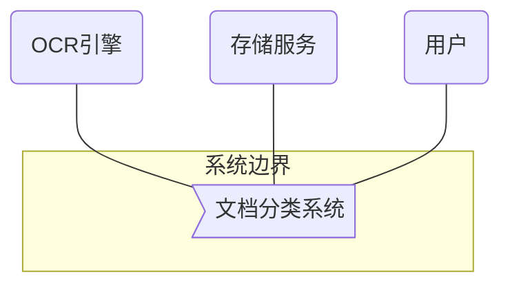
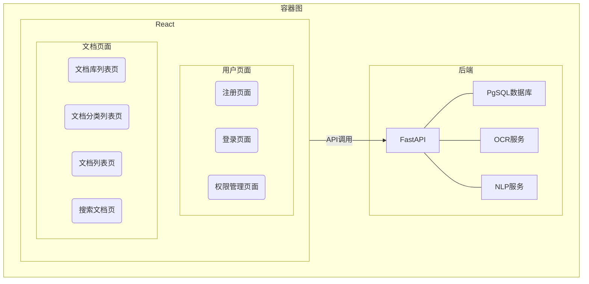
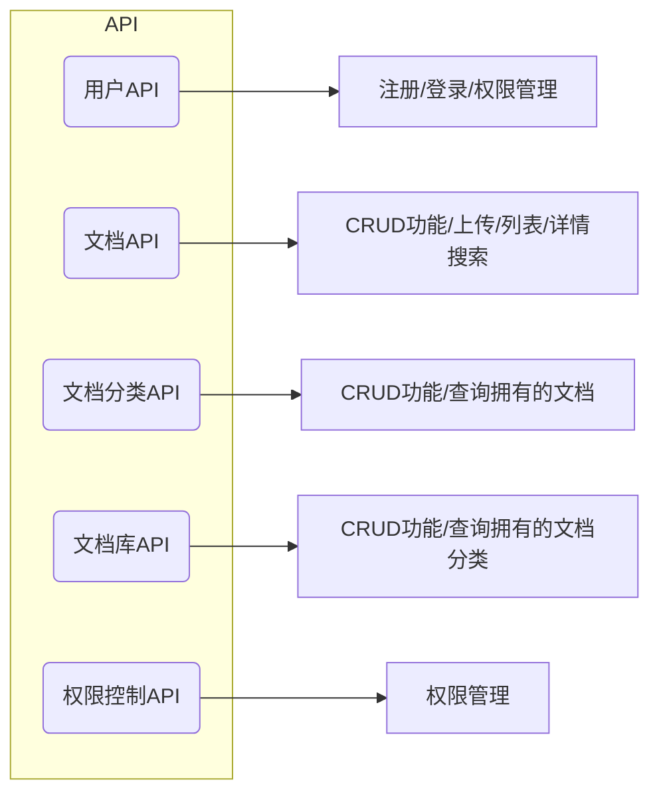
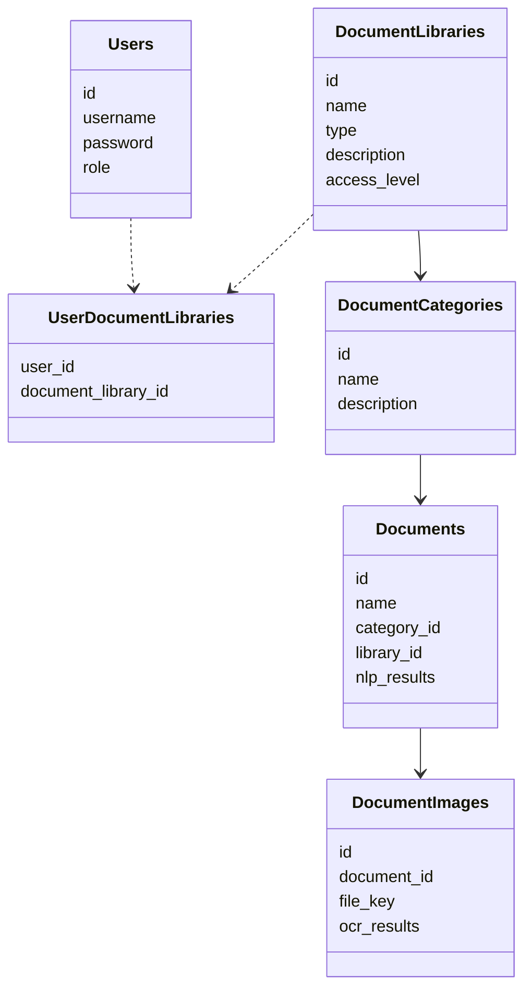

# 系统上下文图

```mermaid
graph TD
    OCR(OCR引擎)
    Storage(存储服务)
    User(用户)

    subgraph 系统边界
        DocApp>文档分类系统]
    end

    OCR---DocApp
    Storage---DocApp
    User---DocApp
```

# 容器图

```mermaid
graph TB

    subgraph 容器图
        subgraph React
        
            subgraph 用户页面
            Register(注册页面)
            Login(登录页面)
            Admin(权限管理页面)
            end
            
            subgraph 文档页面 
            DocLibList(文档库列表页)
            DocCatList(文档分类列表页)
            DocList(文档列表页)
            SearchDoc(搜索文档页)
            end
            
        end


        subgraph 后端
        FastAPI[FastAPI]
        DB[PgSQL数据库]
        OCR[OCR服务]
        NLP[NLP服务]  
        end

    React-->|API调用|FastAPI
    FastAPI---DB
    FastAPI---OCR
    FastAPI---NLP
    end
```

# API接口图

```mermaid
graph LR
subgraph API
U(用户API)
D(文档API)
C(文档分类API)
L(文档库API)
A(权限控制API)
end

U-->注册/登录/权限管理
D-->CRUD功能/上传/列表/详情搜索
C-->CRUD功能/查询拥有的文档
L-->CRUD功能/查询拥有的文档分类
A-->权限管理
```

# 数据库表图

```mermaid
classDiagram
class Users{
  id
  username
  password
  role
}

class Documents{
  id
  name
  category_id
  library_id
  nlp_results
}  

class DocumentImages{
  id
  document_id
  file_key
  ocr_results
}

class DocumentCategories{
  id
  name
  description
}

class DocumentLibraries{
  id
  name
  type
  description
  access_level
}

class UserDocumentLibraries{
  user_id
  document_library_id
}

Users ..> UserDocumentLibraries
DocumentLibraries ..> UserDocumentLibraries


DocumentLibraries --> DocumentCategories
DocumentCategories --> Documents
Documents --> DocumentImages
```