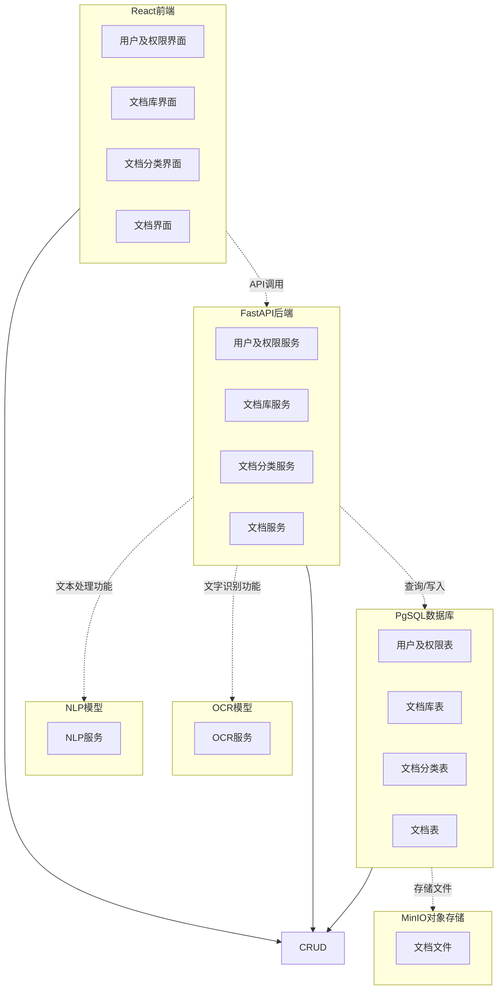

```mermaid
graph TD
    subgraph React前端
        用户及权限界面
        文档库界面
        文档分类界面
        文档界面
    end

    subgraph FastAPI后端
        用户及权限服务
        文档库服务
        文档分类服务
        文档服务
    end

    subgraph OCR模型
        OCR服务
    end

    subgraph NLP模型
        NLP服务
    end

    subgraph PgSQL数据库
        用户及权限表
        文档库表
        文档分类表
        文档表
    end

    subgraph MinIO对象存储
        文档文件
    end
    
    React前端-->CRUD
    FastAPI后端-->CRUD
    PgSQL数据库-->CRUD

    React前端-. API调用 .-> FastAPI后端
    FastAPI后端-. 查询/写入 .-> PgSQL数据库
    FastAPI后端-. 文本处理功能 .-> NLP模型
    FastAPI后端-. 文字识别功能 .-> OCR模型
    PgSQL数据库-. 存储文件 .-> MinIO对象存储


```